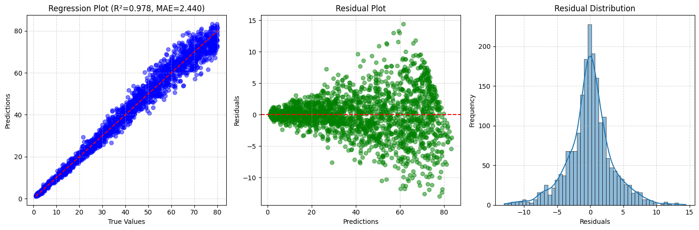

# CNN for Chlorophyll Estimation using Spectral Leaf Data

This directory implements a  1D convolutional neural network (CNN) to estimate chlorophyll content from hyperspectral leaf reflectance data. The spectral data is processed to simulate top-of-atmosphere (TOA) conditions with realistic system noise, mimicking the AVIRIS-NG sensor with 425 spectral bands spanning the 0.4 to 2.5 µm wavelength range.

---

## Dataset

The data consists of:

- **425-band hyperspectral signatures** per leaf sample.
- **Chlorophyll content** labels for each sample.
- Data has been forward-modeled to TOA and includes **added noise** for realism.

---

## Model Architecture

Implemented in PyTorch using `nn.Conv1d`. The architecture is as follows:

- 8 convolutional layers with kernel size 3, stride 2
- LeakyReLU activations with slope 0.01
- Final fully connected layer for regression

## Result

  

<strong>Figure: Chlorophyll content prediction outcome CNN model</strong>

The codes and *Results* for this task are available in the python notebook file- `CNN-based-Chlorophyl-Estimation/1DCNN_chlorophyl_est.ipynb`.

## Conclusion

Using the **1D-CNN** model we were able to achive approx. R-squared of 98%, MAE of 2.40, RMSE of 3.41 on 2000 testing samples. The trendline is is almost linear and perfect and the residuals are normally distributed. However, there exist clearly visible *heteroscedasticity* in the predictions. This can seen in *residual plot* where the residual magnitude is increasing with the predictions which means prediction uncertainty rises for higher predicted values. This might be due to some non-linearity in the relation between predictor variable (spectra) and target variable (chlorophyll) which the model couldn't learn. Such non-linearity could be due to saturation of spectral response after certain higher chlorophyll content concentration and hence leading to underestimation at higher values. This kind of signal saturation behavior is one of the classic problem in chlorophyll remote sensing where reflectance in chlorophyll-sensitive bands (red, blue and NIR) becomes insensitive to further increases in chlorophyll at high concentrations. Overall the model is good enough considering the simplicity of **1D-CNN** model.