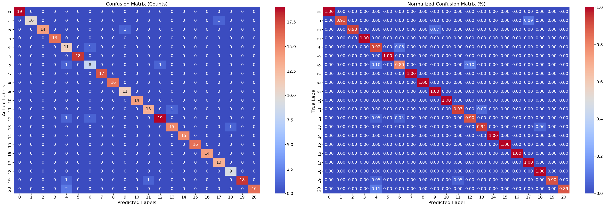

# Transfer Learning for Remote Sensing Image Classification

This work explores transfer learning techniques for remote sensing image classification using the UCMerced dataset. Three different approaches were evaluated: feature extraction with traditional classifiers, fine-tuning only the classification head, and full fine-tuning of a pretrained model.

## Dataset

- **UCMerced Land Use Dataset**
- 21 Classes
- 100 RGB images per class
- Image size: 256 × 256 × 3
- Source: [UCMerced](http://weegee.vision.ucmerced.edu/datasets/landuse.html)

## Tasks Overview

### Task I – Feature Extraction + Off-the-shelf Classifier
- Pretrained ResNet model used to extract image features.
- Features classified using XGBoost classifier.
- Only extracted features used; model weights frozen.

### Task II – Head-Only Fine-tuning
- Classification head of ResNet replaced and trained.
- Backbone (pretrained layers) frozen.
- Suitable for small datasets to reduce overfitting.

### Task III – Full Fine-tuning
- Entire ResNet model made trainable.
- Allows adapting feature representations to the dataset.

## Environment

- Python, PyTorch
- Google Colab + GPU
- Dataset stored in Google Drive
- Normalization: ImageNet stats

## Evaluation Metrics

Each model is evaluated using:
- Accuracy
- Precision
- Recall
- F1-score
- Confusion matrix (and normalized version)

All the codes and *Results* for this task are available in the python notebook file- `Transfer-Learning/Transfer_Learning.ipynb`.

## Results Comparison

| Method                   | Accuracy | Precision | Recall |
|--------------------------|----------|-----------|--------|
| Feature Extraction + XGB |   88.57%  |   89.68%   |  88.57% |
| Head-Only Fine-tuning    |   90.79%  |   91.94%   |  90.79% |
| Full Model Fine-tuning   |   95.87%  |   96.33%   |  95.87% |

  

<strong>Figure: Confusion Matrix for best performing model.</strong>

## Observations and Comments

- **Feature Extraction with Pretrained ResNet18**  
  Using the pretrained ResNet18 as a feature extractor combined with an external classifier (e.g., XGBoost) achieved **~89% accuracy**, **90% precision**, and **89% recall**. This method was efficient and required no deep model training. However, there was **noticeable confusion between visually similar classes**, such as `'denseresidential'` and `'mediumresidential'`, and `'freeway'` vs `'overpass'`.

- **Training Only the Classification Head**  
  Fine-tuning only the final classification layer while keeping the ResNet backbone frozen improved performance to **~91% accuracy**, **92% precision**, and **91% recall**. The model better distinguished between similar classes, reducing some of the confusion seen in the first approach.

- **Full Fine-tuning of the ResNet18 Model**  
  Retraining the entire ResNet18 network on the UCMerced dataset resulted in **~96% accuracy, precision, and recall**. This approach yielded the **best overall performance**, with minimal class confusion. Even previously problematic class pairs (e.g., `'denseresidential'` vs `'mediumresidential'`) were accurately classified, indicating the model had fully adapted to the specific characteristics of the dataset.

