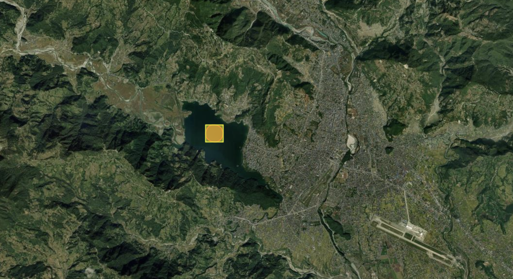
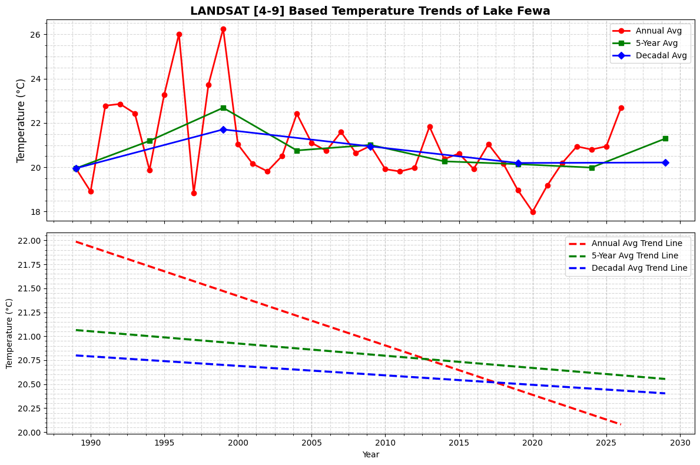

# Histrorical Trend Analysis of Lake Temperatures using LANDSAT Data obtained through Google Earth Engine (GEE).

## Overview
This directory contains an analysis of the historical lake temperature trends using LANDSAT data obtained through Google Earth Engine (GEE). The study focuses on Fewa (Phewa) Lake, Nepal, and aims to determine whether global warming has led to an increase in lake temperature or if local environmental factors have contributed to a temperature decrease.

## Data Collection

The time series lake temperature data was collected using Google Earth Engine and processed to compute annual, five-year, and decadal temperature averages. The temperature data is derived from multiple LANDSAT sensors (LANDSAT 4-9) over a period from 1989 to 2025.

## Study Area

Fewa Lake, located in the Pokhara Valley, is Nepal’s second-largest lake and a popular tourist destination. Despite its scenic beauty, the lake has faced environmental challenges, including pollution from urbanization and invasive species. The analysis investigates how these factors might have influenced the lake’s thermal profile over time.

<p align="center">
  
</p>
<p align="center"><strong>Figure 1: View of Fewa Lake</strong><br>
Source: <a href="https://en.wikipedia.org/wiki/Phewa_Lake" target="_blank">Wikipedia</a></p>


## Directory Structure
```

├── extracted_data
│   ├── lake_temperature_time_series.csv
├── scripts
│   ├── Lake_temperature_trends_data_collection.ipynb  # For extracting the time-series temperature data using multiple Landsats (part I)
│   ├── data_analysis.ipynb  # Trend analysis of extracted time-series temperature data (part II)
├── README.md

```

## Results

<p align="center">
  
</p>
<p align="center">
  
</p>
<p align="center">
  <strong>Figure 2:</strong> Satellite Image of Lake of Interest and selected ROI (a) and Temperature trend plot (b).
</p>


## Key Findings

The temperature trend plot presented above shows the average temperature plot *(Top)* over time since 1989 till 2025 and the trendline *(Bottom)* based on those average temperature. It is interesting to see that the trendline shows decreasing lake temperature overtime. This mean that the effect of *local environmental variations* is driving towards decreasing the net lake temperature rather than increasing due to *global warming*. Such decrease in temperature over time could be attributed to certain factors:

- First, the lake is at relatively higher altitude *(742 m)* above sea level and closer to the himalayan ranges which might have influenced in maintaining the temperature to a certain level and prevent it from increasing.
- Second, the average temperature might not be actually changing but due to the calibration issues with previous LANDSATs it is showing higher values for those earlier LANDSATs. 
- Third, and most likely reason is due to- (i) increasing level of pollution over time due to large scale poorly managed urbanization resulting in increased areosols content in atmosphere (causes *global dimming*) as well as mixing of solid pollutant into the lake from industries and local bussinesses, (ii) dense algal bloom on surface waters can shade the deeper water (*eutrophication*) increasing shading effect,  (iii) high sediment influx during monsoons reduce water transparency, limiting sunlight penetration and hence decrease temperature. Overall these lake specific effects have resulted in overriding the broader warming trend.

## Conclusion

In conclusion, the decreasing temperature trend in lake *Fewa* in contrast to *golbal warming* should be a key motivation for additional research into the underlying reasons, such as the functions of pollution, sedimentation, and shifting hydrological dynamics, in order to better understand and remedy the factiors impacting the thermal attibutes of the lake.

*Final Comment: Data and trends can be obtained for almost any lake in the world using the provided resources*

## License

This project is licensed under the MIT License.

