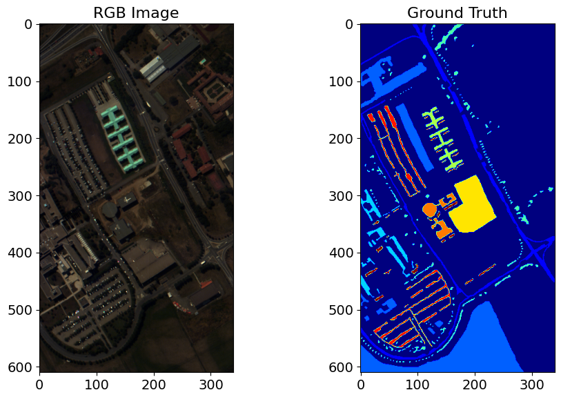
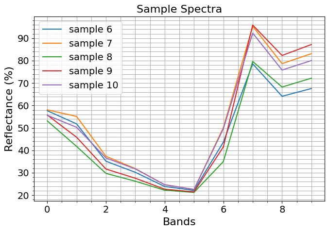
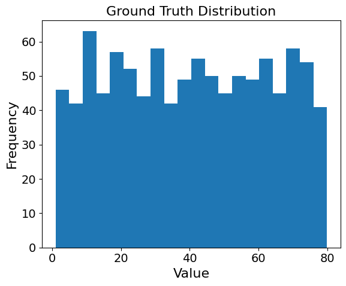

# Hyperspectral Classification and Regression

## Task I: Hyperspectral Classification on Pavia University Dataset

### **Task Definition**  

The Pavia University dataset is a hyperspectral image dataset gathered by the Reflective Optics System Imaging Spectrometer (ROSIS-3) over the city of Pavia, Italy. The dataset consists of **610×340** pixels and **103 spectral bands**. The number of classes and the corresponding number of samples are shown below. The dataset is imbalanced, which may impact the classification performance.

The ROSIS sensor captures wavelengths between **430-960 nanometers** with a **5-nanometer spectral spacing**.

### **Objectives**  
In this task, we perform the following:

- **Exploratory Data Analysis (EDA)**
- **Binary Classification** using **Logistic Regression**
- **Multi-class Classification** using the **XGBoost Algorithm**

### **Dataset**  

The dataset used for classification is the **Pavia University Dataset**. This dataset includes hyperspectral images and ground truth labels for various classes in the urban area of Pavia.

<p align="center">
  
</p>
<p align="center"><strong>Figure: Pavia University Dataset</strong></p>

The codes for this task are in the file `Classification/classification.ipynb`.

---

## Task II: Hyperspectral Regression: Chlorophyll Content Prediction

### **Task Definition**  

In this task, we use the dataset `landis_chlorophyl_regression.npy` and `landis_chlorophyl_regression_gt.npy`, generated using a combination of the **PROSPECT** radiative transfer model for leaf reflectance spectra at varying chlorophyll levels and **MODTRAN** for forward modeling the spectral data. This dataset simulates observations from the **Landsat** next satellite.

The dataset consists of 10 spectral bands in the visible to near-infrared region, listed below:

| Band Name    | Center Wavelength (nm) |
|--------------|:-----------------------:|
| Blue         | 490                     |
| Green        | 560                     |
| Yellow       | 600                     |
| Orange       | 620                     |
| Red 1        | 650                     |
| Red 2        | 665                     |
| Red Edge 1   | 705                     |
| Red Edge 2   | 740                     |
| NIR_Broad    | 842                     |
| NIR1         | 865                     |

The dataset includes **1000 samples** with 10 spectral bands and corresponding chlorophyll content obtained from the original **Prospect simulation**. This is a regression task where the goal is to predict the chlorophyll content using the spectral band values as features.

### **Objectives**  
In this task, we perform the following:

- **Exploratory Data Analysis (EDA)**
- **Regression Models**:
  - *Linear Regression*
  - *Partial Least Square Regression (PLSR)*
  - *Multi-Layer Perceptron (MLP)*

### **Dataset**  

The dataset used for regression is the **Chlorophyll Content Prediction Dataset**. This dataset contains simulated leaf reflectance spectra and corresponding chlorophyll content at varying levels. Below is a plot of sample spectra used for the task:

<p align="left">
  
  
</p>
<p align="center"><strong>Figure:</strong> Spectral bands data (left) and Chlorophyll Content Histogram (right)</p>

The codes for this task are in the file `Regression/regression.ipynb`.

---

### **Overall Directory Structure**

```plaintext
- Classification/
  - classification.ipynb
- Regression/
  - regression.ipynb
