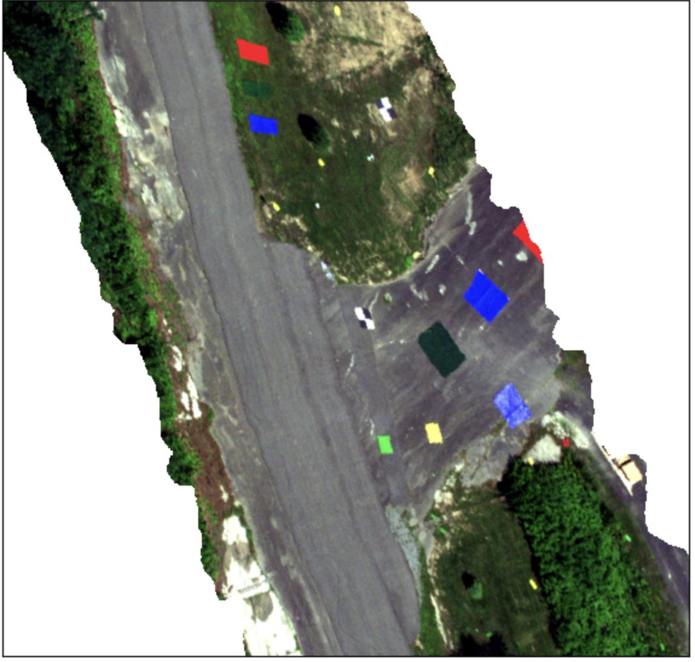
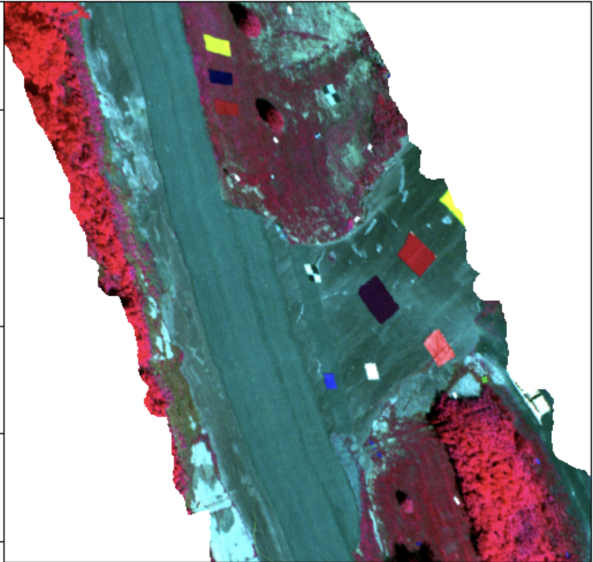
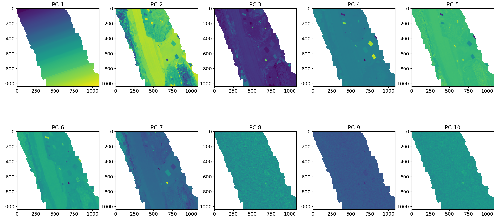
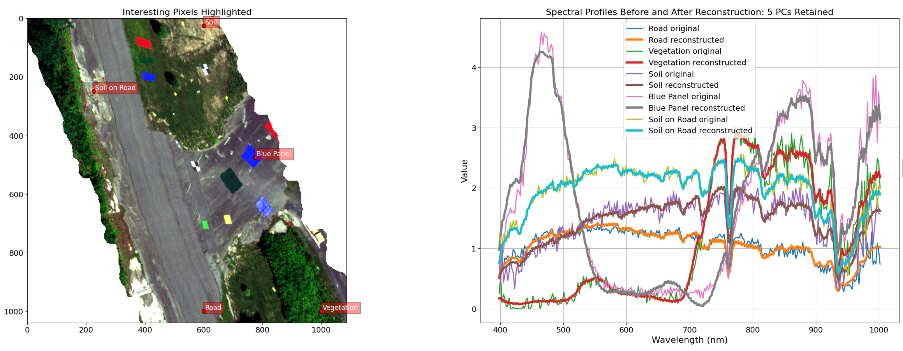
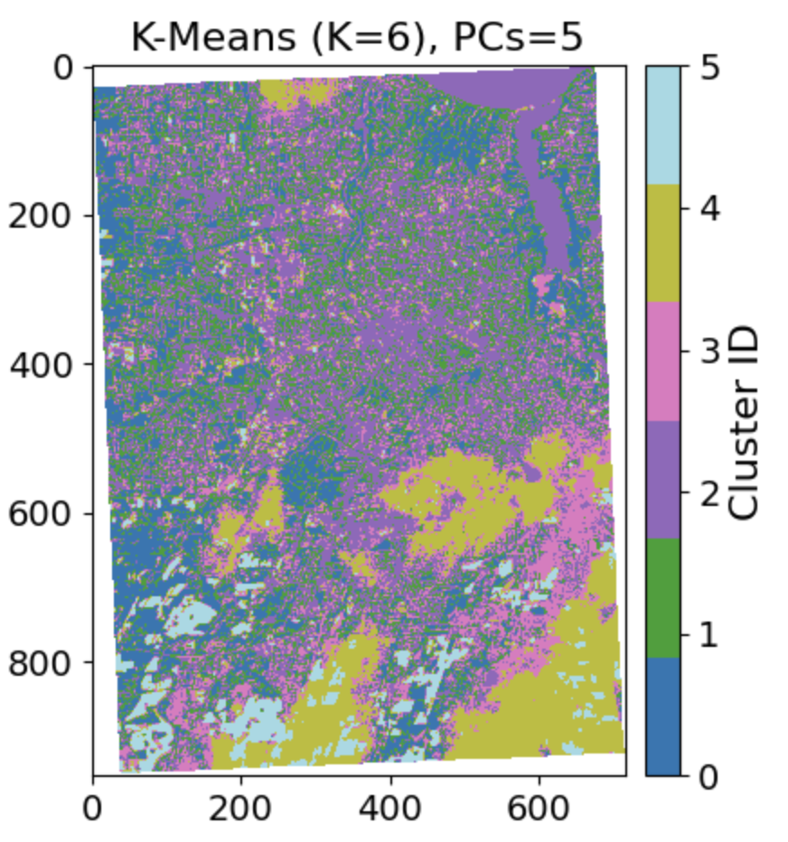
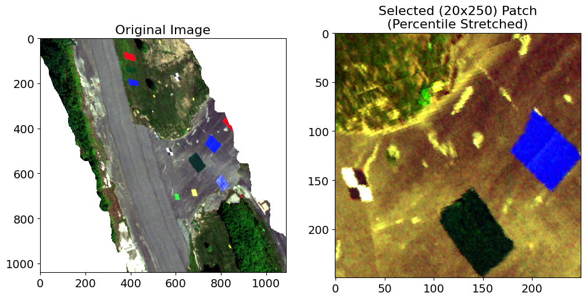
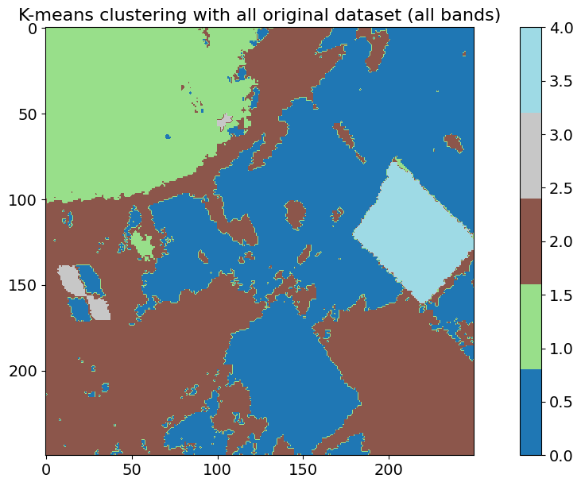
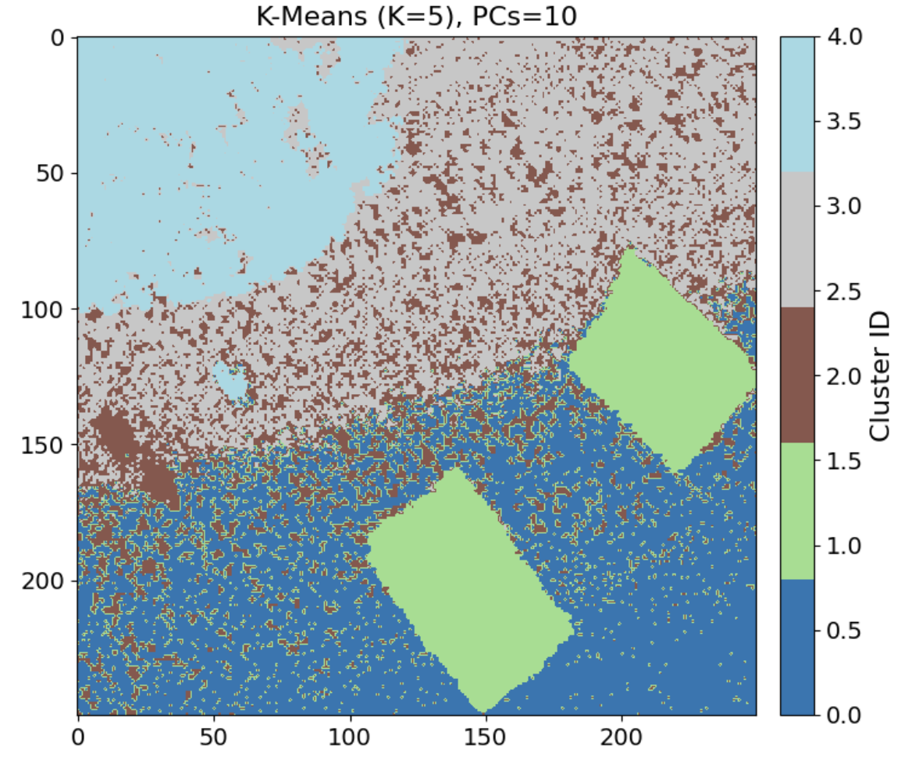

# Hyperspectral Data Analysis, Principal Component Analysis and Clustering (K-Means) 

## Overview  
This work analyzes hyperspectral data collected by the **RIT MX1 drone** over the **RIT Tait Reserve**. The workflow includes:  

- **Data visualization**  
- **Principal Component Analysis (PCA)** for dimensionality reduction  
- **Noise reduction** using PCA  
- **K-Means clustering** on hyperspectral and Sentinel-2 multispectral data  

## Dataset  
The dataset consists of **ENVI-format hyperspectral images**:  
- `taitlabsphere` (image data)  
- `taitlabsphere.hdr` (metadata)  

## Methods  

### 1. Data Preprocessing & Visualization  
- Loaded the dataset using **Spectral Python (SPy)**.  
- Visualized RGB and false-color composites.  

### 2. Principal Component Analysis (PCA)  
- Used **Singular Value Decomposition (SVD)** for dimensionality reduction.  
- Visualized the top principal components and their variance contribution.  
- Analysis of PCA components and their contributions.
- Applied PCA-based **noise reduction** by reconstructing from principal components.  

### 3. K-Means Clustering  
- Implemented **K-Means clustering** on PCA-reduced features for simple *RGB image*, *Sentinel-2 multispectral image* and given *Hyperspectral image*.  
- Compared clustering performance across different feature dimensions (PCs) as well as its performance across different imgagery data.  

## Project Structure  
```plaintext
📂 hyperspectral-analysis
│── 📄 PCA_and_ML_code.ipynb    # Contains all code (PCA, visualization, clustering)  
│── 📄 README.md                # Project Explanation
│── 📂 Results/                 # Contains samples of generated figures and analysis
```

## Sample Results and Comments

### 1. HSI Data Visualization
<p align="left">
  
  
</p>
<p align="center"><strong>Figure:</strong> RGB (left) and CIR false-color (right) imagery extracted from HSI data.</p>

**Comments**: Figure on left shows the RGB image formed by stacking bands closest to Blue (450 nm), Green (550 nm) and Red (650 nm) bands and Figure on right shows the CIR (colored infrared) version of given hyperspectral image. We can see that since the reflectance of vegetation in infrared region in very high, almost all the vegetation pixels are highlighted with red color. Such plot can be used to visually assess the vegetation areas in the image and to some extent infer the health of vegetation.

### 2. PCA Components
<p align="center">
  
</p>
<p align="center"><strong>Figure:</strong> PCA components extracted from the hyperspectral image.</p>

**Comments**: The plot for 10 PC transformed data is shown in the figure. From the plots we can see that PC1 (which represent highest variance) contains changes in elevations (topography). In other words highest variation in our data is due to elevation differences in the imagery. Its quite interesting to see that using PCA on HSI data we can get information about topographical variations in the scene. Similarly, second PCA (PC2) highlights road area, PC3 is almost same as green band image (visually), PC4 highlights blue targets, PC5 and PC6 dont really show much variations, PC7 highlights vegetation to some extent and after that the bands get noisy. So from visual inspection we can say that after band 4 there is not much data variance information in the bands.

### 3. Data Reconstruction
<p align="left">
  
</p>
<p align="center"><strong>Figure:</strong> Spectral reconstruction using PCA.</p>

**Comments**: Analysing the explained variance we saw that even single PC explains more than 99% of variance in the original data. Even though PC1 captures 99% of the variance, when we take interesting pixels in the imagery reconstructed by using just that PC, we see that all those pixels have spectrum similar to the average of the original data. So we can contend that PC1 capture average spectral information in all bands which caused maximum variation in the data. However, this single PC is not able to capture the subtle difference in the spectral information of different pixels and targets in the imagery. When more PCs included (around 5), the reconstruction improves and we could say *noiseless* version of the spectral difference clearly *(shown above)*.

### 4. 16 Bands Sentinel-2 Imagery Clustering
<p align="left">
  
  
</p>
<p align="center"><strong>Figure:</strong> Sentinel-2 RGB image (left) and clustered image using K-means (right).</p>

**Comments**: The K-means algorithm was used for clustering *Sentinel-2* imagery using PCA reduced dimension data, into 6 classes (K=6) and the results is shown above. Even for just 5 PC  the clustering is good enough to seperate pixels into clusters of *clouds (yellow)*, *water (purple)*, *concrete (city and building area)(magenta)*, *land patches   (skyblue)* and *vegetation (green + blue)*. The color mentioned can be different with different number of PC because a pixel assigned to one cluster in one plot can be assigned to another based on additional information available with changing number of PCs.
However adding more band creates a subtle boundary between cluster transitions due to the addition of more variation in the data.

### 5. HSI Patch Reconstruction and Comparison
#### **Selected HSI Patch:**
<p align="left">
  
</p>
<p align="right"><strong>Figure:</strong> Extracted 250x250 HSI patch (right).</p>

**Comments**: A 250x250 patch containing the calibration panels, Road surface, soil and vegetation is selected based on visual inspection. Next the *subset image* is used to find the clusters of pixels using K-means.

#### **Clustered Image Comparison:**
<p align="left">
  
  
</p>
<p align="center"><strong>Figure:</strong> Clustered patch using all bands (left) vs. PCA-reduced data (right).</p>

**Comments**: Taking all *273* bands in original image *(left)* didnt give quite good result compared to using lower number of PC feature *(right)*. On left we can differentiate *vegetation (green)*, *cal panel (blue and light brown)*, *blue panel (cyan)*. But the *green panel is mixed with background road (blue)* and the *background road is itself divided into two clusters (blue and brown)*. This means even using all bands in original HSI image doesnt give a clear distinction between different targets in the scene. I would say that taking just 10 PC bands for clustering gives us a better result than taking all bands in original data. But it should also be noted that *K-means* algorithm itself has user dependency for clustering the classes and may not be the best algorithm for unsupervised classification. 


